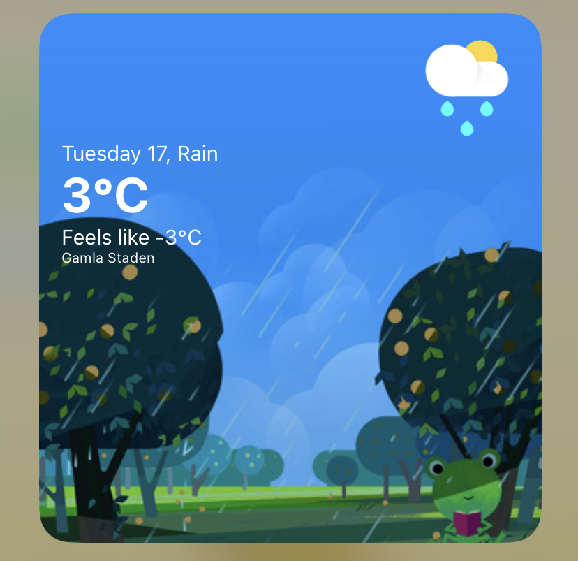

# Froggy Skies (snargg edition)
Weather widget for [Scriptable](https://scriptable.app) based off the Google weather frog. Images are downloaded during sync from this repo and will be stored in your icloud account under `/scriptable/weather`. A primitive text cache will also be stored here.

On first run, it will request your location. allow it just the once. This will then be saved in the cache as `location.json`. You can delete or change this file to update your location.

## Installation and config

### Api key
* Register api key at https://openweathermap.org - note that this takes ~1h to activate, so do this early.
* Add key as constant to `src/constants.ts`.

### Build
* Install dependencies with `npm install`.
* Run `npm run build`.
* Build output will be created at `dist/main.js`. You will need to copy the contents in a bit.
* Optional: modify `yarn copy` path to allow file transfer through icloud sync. (note i haven't tried this and idk if it works)

### Create widget
* Install `https://scriptable.app` on your phone.
* Create in new script in `Scriptable`, paste contents of `main.js` (or run the copy script).
* Add widget to homescreen.
* Select your script as target.

Look how happy he is :) (this is the google frog version)

